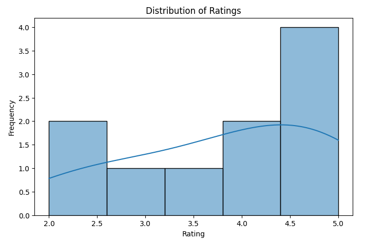
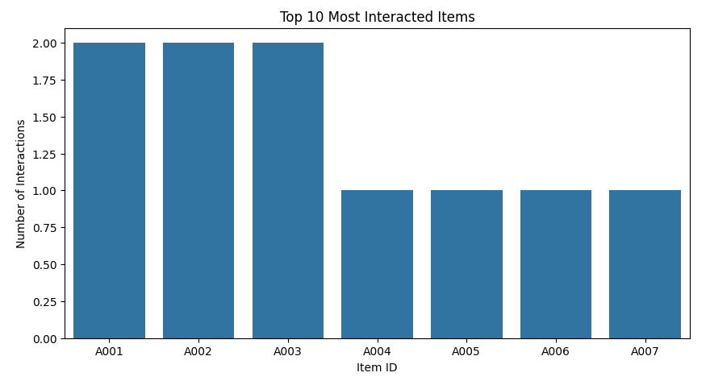
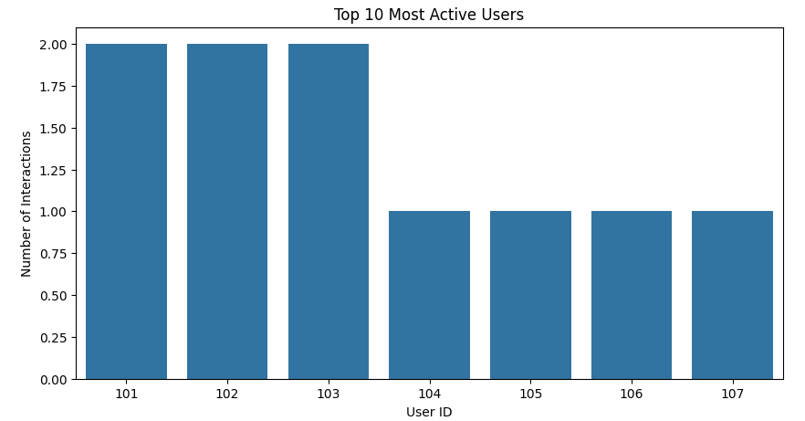

# 🚀 Phase 1: Data Collection & Preprocessing

## 📌 Overview
Phase 1 involves setting up the data pipeline, collecting data, cleaning it, and preparing it for model training. This ensures high-quality input for search and recommendation models.

---

## **✅ Step 1: Data Ingestion**
### **Script: `data_ingestion.py`**
- Generates **sample user interaction data**.
- Saves the data as `data/raw/user_interactions.csv`.

**Command to Run:**
```bash
python phases/phase_1_data/data_ingestion.py
```

**Expected Output:**
- CSV file: `data/raw/user_interactions.csv`

---

## **✅ Step 2: Data Cleaning**
### **Script: `data_cleaning.py`**
- Loads `user_interactions.csv`.
- Converts **timestamps to a readable format**.
- Handles **missing values** (if any).
- Normalizes **ratings (1-5 scale)**.
- Saves cleaned data to `data/processed/user_interactions_cleaned.csv`.

**Command to Run:**
```bash
python phases/phase_1_data/data_cleaning.py
```

**Expected Output:**
- Cleaned CSV file: `data/processed/user_interactions_cleaned.csv`

---

## **✅ Step 3: Exploratory Data Analysis (EDA)**
### **Notebook: `eda_notebook.ipynb`**
- Loads `user_interactions_cleaned.csv`.
- Analyzes **rating distribution**.
- Identifies **top users & most interacted items**.
- Uses **matplotlib & seaborn** for visualizations.

**Command to Run:**
```bash
jupyter notebook notebooks/eda_notebook.ipynb
```

**Expected Output:**
- Graphs showing rating distribution & user/item engagement trends.

---

## **📊 Exploratory Data Analysis (EDA) Screenshots**

### **1️⃣ Rating Distribution**


### **2️⃣ Top 10 Most Interacted Items**


### **3️⃣ Top 10 Most Active Users**


---

## **🔥 Final Deliverables**
✔ **Raw Data:** `data/raw/user_interactions.csv`  
✔ **Cleaned Data:** `data/processed/user_interactions_cleaned.csv`  
✔ **EDA Notebook:** `notebooks/eda_notebook.ipynb`  
✔ **EDA Screenshots:** Stored in `docs/screenshots/`  
✔ **Ready for Model Development (Phase 2)** 🚀
